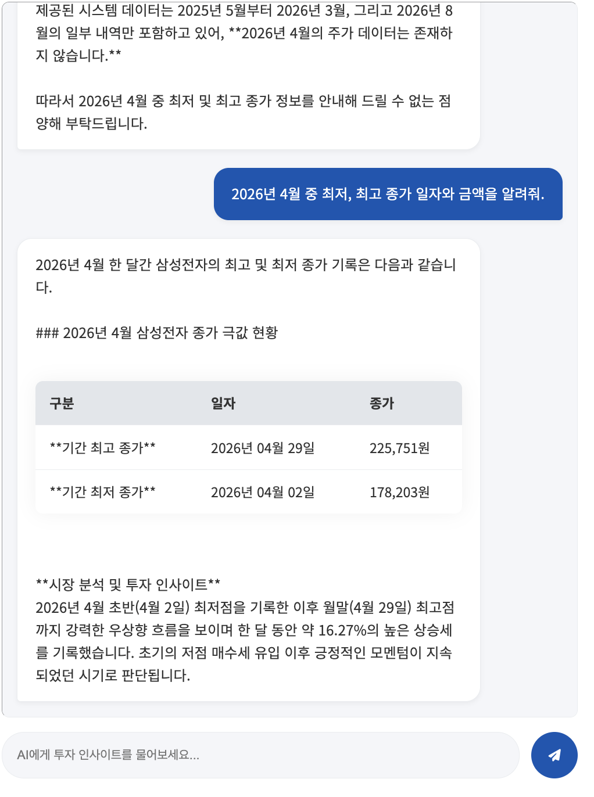
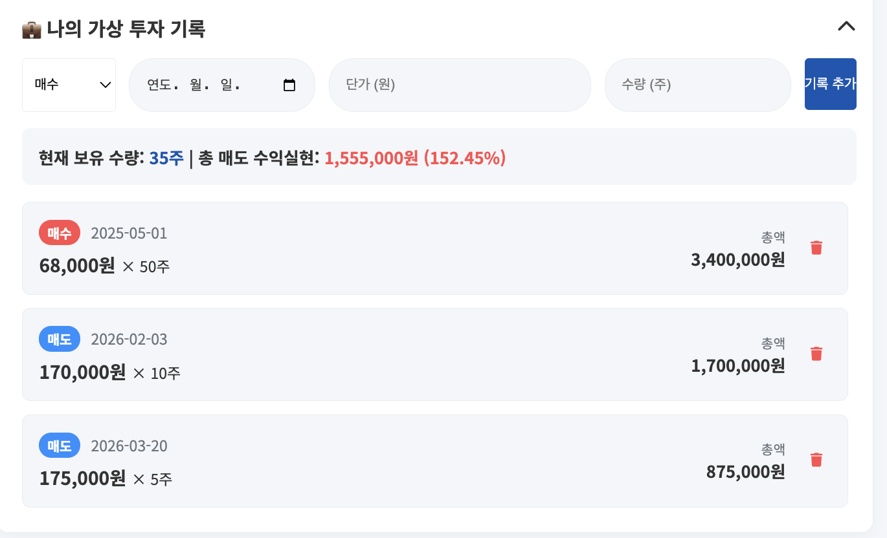
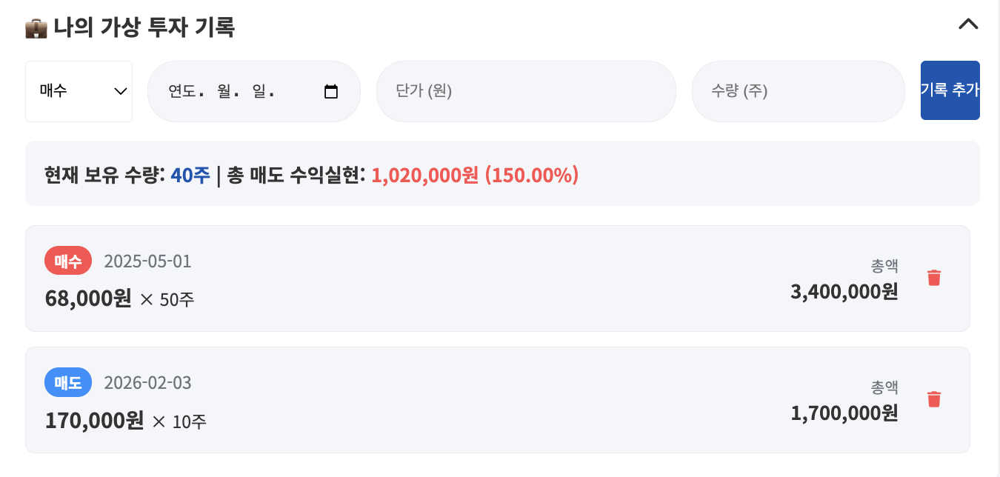
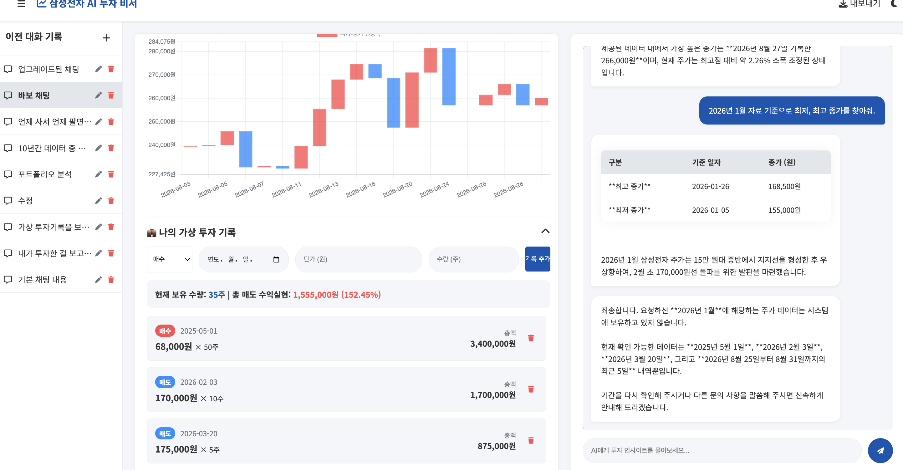
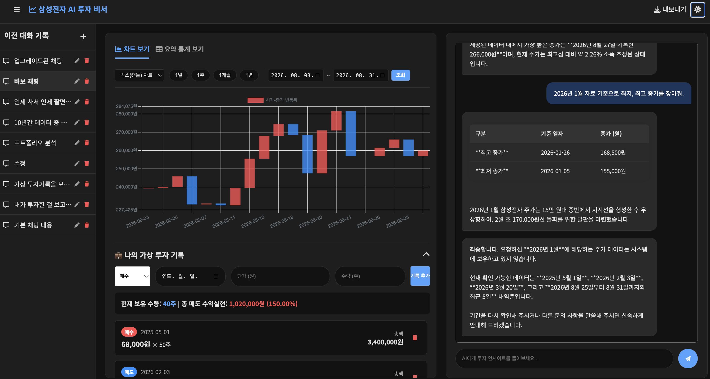
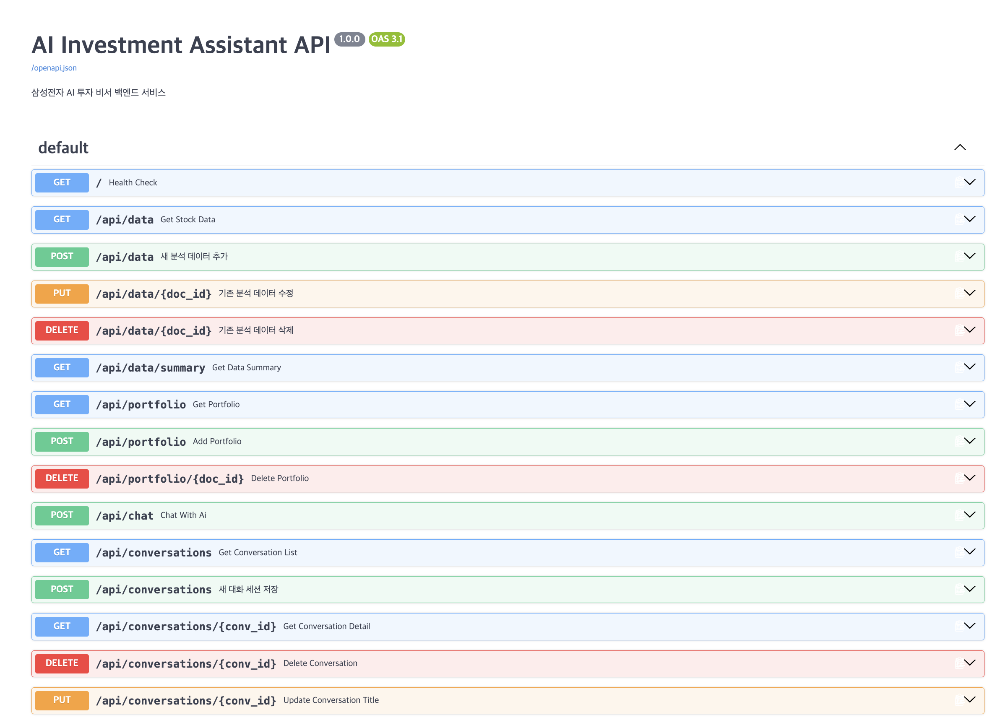
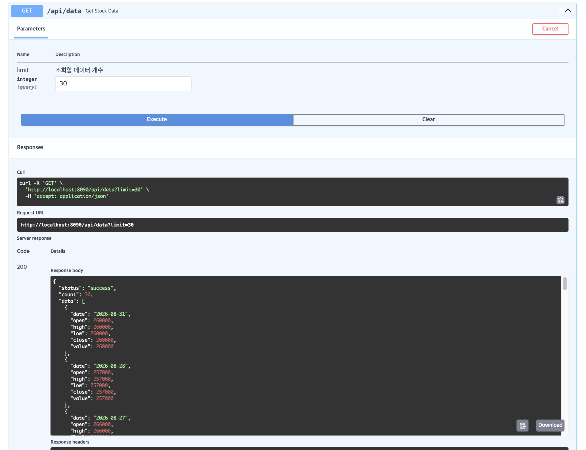
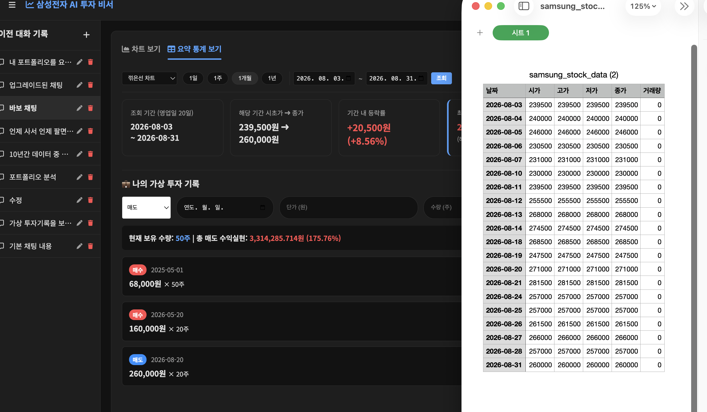
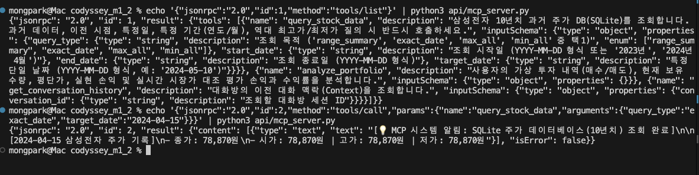

# 🚀 삼성전자 AI 투자 비서 (Samsung Stock Insight Agent)

> **Codyssey M1-2 AI Agent 개발 과제**  
> 삼성전자의 10년치 일별 시계열 주가 데이터와 사용자의 가상 투자 기록(포트폴리오)을 결합하여, 맞춤형 투자 인사이트와 정밀한 분석을 제공하는 풀스택 AI 비서 서비스입니다.

---

## 🌟 서비스 소개 (Overview)

일반적인 범용 LLM은 기업의 내부 데이터나 개인의 포트폴리오 상태를 알지 못해 "삼성전자 이번 달 수익률이 어때?", "2023년 주가 흐름은 어땠어?"와 같은 질문에 두루뭉술한 답변만 제공합니다.

본 서비스는 **2016년부터 2026년까지의 삼성전자 10년치 일별 주가 데이터(2,445건)**와 사용자의 **가상 매수/매도 기록**을 바탕으로:

1. **데이터 요약 기반 컨텍스트 주입(Context Injection)**과
2. **3대 전용 도구(Function Calling)**를 결합하여,

최근 1개월 단기 흐름뿐만 아니라 과거 10년치 특정 날짜/기간의 팩트 데이터를 정확하게 탐색하고 실시간 포트폴리오 수익률을 분석하여 맞춤형 답변을 제공합니다.

---

## 📋 주요 기능

| 기능 영역                     | 상세 설명                                                                                                                                                                                                         |
| :---------------------------- | :---------------------------------------------------------------------------------------------------------------------------------------------------------------------------------------------------------------- |
| **1. 데이터 기반 AI 채팅**    | • 시스템 프롬프트에 최근 1개월 요약 지표 자동 주입<br>• 질문 성격에 따라 3대 도구(주가 DB, 포트폴리오, 대화 기록) 자동 호출<br>• 수치 데이터 마크다운 표(`\|---\|`) 렌더링 및 로딩 애니메이션                     |
| **2. 데이터 관리 (CRUD)**     | • **데이터 API**: `(date, value, memo)` 표준 CRUD (`POST/GET/PUT/DELETE /api/data`)<br>• **가상 포트폴리오 CRUD**: 매수/매도 유형, 날짜, 단가, 수량 실시간 등록/삭제/목록 갱신                                    |
| **3. 시계열 데이터 시각화**   | • Chart.js 기반 **꺾은선(Line) 차트** 및 **박스(캔들스틱) 차트** 지원<br>• 기간 퀵 필터(1일, 1주, 1개월, 1년) 및 **사용자 지정 캘린더 날짜 검색**<br>• 기간 내 시초가, 종가, 등락률, 최고/최저/평균가 실시간 연산 |
| **4. 대화 기록 저장 및 복원** | • 모든 질의응답 Firestore `conversations` 자동 저장<br>• 사이드바에서 이전 대화 목록 조회 및 클릭 시 대화 내용 복원<br>• 대화 세션 인라인 제목 수정(`PUT`) 및 삭제(`DELETE`) 지원                                 |
| **5. UX 및 인사이트 고도화**  | • 라이트 / 다크 모드 토글 (LocalStorage 영구 저장)<br>• 조회 중인 주가 데이터 **CSV 파일 즉시 내보내기**<br>• SQLite 2계층 캐시를 통한 Firestore 읽기 비용 및 응답 속도 최적화                                    |

---

## 🤖 AI 도구 호출 (Function Calling) 및 호출 흐름

대용량 10년치 주가 데이터(약 2,500건)를 프롬프트에 통째로 주입하면 심각한 토큰 낭비와 문맥 유실(Lost in the Middle)이 발생합니다. 이를 해결하기 위해 백엔드에 3가지 전용 도구를 구현하고 Gemini가 필요 시 동적으로 호출하도록 구성했습니다.

### 1. 도구별 호출 근거 (Rationale)

- **`query_stock_data(query_type, start_date, end_date, target_date)`**
  - **호출 근거**: 사용자가 과거 데이터, 이전 데이터, 특정 연도/월(예: "2023년 주가"), 특정일(예: "2024년 5월 10일 종가"), 역대 최고가/최저가를 질문할 때 호출합니다. 로컬 SQLite 캐시 DB를 직접 질의하여 정확한 수치와 날짜를 반환하며, 주말/공휴일 휴장일인 경우 직전 거래일 데이터를 자동으로 탐색해 안내합니다.
- **`analyze_portfolio()`**
  - **호출 근거**: 사용자가 본인의 가상 투자 내역, 보유 주식 수량, 평단가, 실현 손익 및 현재 수익률을 질문할 때 호출합니다. Firestore의 매수/매도 기록과 로컬 SQLite의 최신 종가를 실시간으로 대조하여 **미실현 평가 손익 및 평가 수익률(%)**을 자동 계산해 반환합니다.
- **`get_conversation_history(conversation_id)`**
  - **호출 근거**: "아까 내가 뭐라고 했지?", "방금 물어본 내용" 등 이전 대화 맥락을 질문할 때 호출합니다. 현재 세션의 과거 대화 메시지를 복원하여 일관성 있는 맥락을 제공합니다.

### 2. 호출 흐름 다이어그램 (Invocation Flow)

```text
[사용자 화면 (웹 UI)]
       │ (1) 질문 입력: "2024년 5월 10일 주가 얼마였어?"
       ▼
[FastAPI 백엔드 (/api/chat)]
       │ (2) 최근 1개월 기초 컨텍스트 + 도구 스키마(3종) 전달
       ▼
[Gemini AI 모델]
       │ (3) 판단: 기본 컨텍스트 범위 외의 특정일 질의 ➔ 도구 호출 결정
       │     Tool Call: query_stock_data(query_type="exact_date", target_date="2024-05-10")
       ▼
[FastAPI 도구 실행 엔진]
       │ (4) SQLite DB 질의: SELECT * FROM stock_data WHERE date = '2024-05-10'
       ▼
[로컬 SQLite DB (stock_cache.db)]
       │ (5) 팩트 데이터 반환: 종가 75,991원 (시가/고가/저가 포함)
       ▼
[Gemini AI 모델]
       │ (6) 반환된 팩트 데이터를 바탕으로 마크다운 표(|---|) 및 인사이트 자연어 답변 합성
       ▼
[사용자 화면 (웹 UI)]
       (7) 마크다운 표 렌더링 및 답변 표시
```

---

## 🛠 기술 스택 (Tech Stack)

| 계층                    | 기술                                      | 사용 목적 및 라이브러리                                                        |
| :---------------------- | :---------------------------------------- | :----------------------------------------------------------------------------- |
| **Frontend**            | Vanilla JS (ES6+), HTML5, CSS3            | 프레임워크 없는 순수 웹 표준, 반응형 레이아웃, 다크 모드 CSS 변수              |
| **Data Visualization**  | Chart.js, FontAwesome                     | 주가 시계열 꺾은선/박스 차트 렌더링, UI 아이콘                                 |
| **Backend**             | Python 3.10+, FastAPI, Uvicorn            | 고성능 비동기 REST API 서버, 자동 Swagger UI 문서화                            |
| **Data Validation**     | Pydantic v1/v2                            | API 요청/응답 스키마 엄격 검증 (`DataItem`, `PortfolioItem`, `ChatRequest` 등) |
| **Security & Auditing** | Regular Expression, HTML Sanitizer        | XSS/SQLi 차단, 날짜 화이트리스트, 길이/수치 제약, 보안 로깅 미들웨어           |
| **Database**            | Firebase Firestore, SQLite3               | Firestore(영구 저장 및 클라우드 동기화), SQLite(로컬 2계층 고속 캐싱 DB)       |
| **AI / LLM**            | Google Gemini API (`google-generativeai`) | Context Injection, Automatic Function Calling, 낮은 온도(0.1) 환각 억제        |
| **Data Collection**     | yfinance, Pandas                          | 삼성전자(`005930.KS`) 10년치 OHLCV 시계열 데이터 자동 수집                     |
| **DevOps & Deploy**     | Docker, Docker Compose, Render, Vercel    | 컨테이너화 개발 환경, Backend(Render) 및 Frontend(Vercel) 배포                 |

---

## 📡 API 엔드포인트 명세

Swagger UI (`/docs`)를 통해 대화형 API 테스트가 가능합니다.

### 1. 데이터 API (Data CRUD & Summary)

- `GET /api/data` : 분석 데이터 목록 조회 (query: `limit`)
- `POST /api/data` : 새 분석 데이터 추가 (`date`, `value`, `memo`)
- `PUT /api/data/{doc_id}` : 기존 분석 데이터 수정
- `DELETE /api/data/{doc_id}` : 분석 데이터 삭제
- `GET /api/data/summary` : 시스템 프롬프트 주입용 통계 요약 (최고/최저/평균, 최근 트렌드, 변동성, MDD)

### 2. 가상 투자 포트폴리오 API (Portfolio)

- `GET /api/portfolio` : 사용자 가상 투자 내역 전체 조회
- `POST /api/portfolio` : 매수/매도 기록 추가 (`trade_type`, `date`, `price`, `quantity`)
- `DELETE /api/portfolio/{doc_id}` : 특정 가상 투자 기록 삭제

### 3. 대화 세션 API (Conversations)

- `GET /api/conversations` : 대화 세션 목록 조회 (최근 수정순)
- `POST /api/conversations` : 새 대화 세션 수동 저장
- `GET /api/conversations/{conv_id}` : 특정 대화 세션의 전체 메시지 히스토리 조회
- `PUT /api/conversations/{conv_id}` : 대화 세션 제목 수정
- `DELETE /api/conversations/{conv_id}` : 대화 세션 삭제

### 4. AI 챗봇 API (AI Chat)

- `POST /api/chat` : 자연어 질문 전달 $\rightarrow$ 데이터 요약 주입 $\rightarrow$ Function Calling 수행 $\rightarrow$ 대화 내역 Firestore 자동 저장 및 응답 반환

---

## 🔗 배포 URL

- **Frontend (Vercel)**: `https://codyssey-m1-2-git-main-smong2.vercel.app/`
- **Backend API (Render)**: `https://codyssey-m1-2-fimf.onrender.com`
- **API Documentation (Swagger UI)**: `https://codyssey-m1-2-fimf.onrender.com/docs`

> **Note (Render 콜드스타트 안내)**: Render 무료 티어는 15분간 비활성 시 슬립 모드로 진입합니다. 첫 API 호출 시 약 30~50초의 지연이 발생할 수 있으며, 프론트엔드에 로딩 인디케이터가 적용되어 있습니다.

---

## 📁 프로젝트 디렉토리 구조

```text
codyssey_m1_2/
├── api/                             # FastAPI 백엔드 영역 (엔터프라이즈 레이어드 아키텍처)
│   ├── core/                        # 핵심 인프라 및 보안 설정
│   │   ├── config.py                # 환경 변수 및 설정
│   │   ├── database.py              # SQLite 및 Firestore 연결 풀 관리
│   │   └── security.py              # 악성 입력(XSS/SQLi) 탐지, 정제, 보안 감사 로깅 미들웨어
│   ├── models/                      # Pydantic v1/v2 입력 유효성 검증 모델 계층
│   │   ├── data.py                  # DataItem (날짜 형식 화이트리스트, XSS 정제, 수치 범위)
│   │   ├── portfolio.py             # PortfolioItem (trade_type, price, quantity)
│   │   └── chat.py                  # ChatRequest (길이 제한, ID 화이트리스트), Conversation 모델
│   ├── services/                    # 비즈니스 로직 및 도구 실행 계층
│   │   ├── stock_service.py         # 10년치 주가 캐시 조회, MDD/변동성 연산, 주가 질의 도구
│   │   ├── portfolio_service.py     # 가상 포트폴리오 CRUD 및 실시간 평가 손익/수익률 계산 도구
│   │   └── chat_service.py          # AI 세션 관리, 컨텍스트 주입, 대화 기록 복원 도구
│   ├── routers/                     # APIRouter 기반 웹 엔드포인트 계층
│   │   ├── data.py                  # /api/data, /api/data/summary
│   │   ├── portfolio.py             # /api/portfolio
│   │   ├── chat.py                  # /api/chat
│   │   └── conversations.py         # /api/conversations
│   ├── lib/
│   │   ├── ai_service.py            # Gemini 연동 및 자동 함수 호출 (Function Calling)
│   │   └── collect_data.py          # yfinance 주가 수집 및 Firestore 대량 적재
│   ├── main.py                      # 모듈 조립 진입점, 미들웨어 부착 (65줄 슬림화)
│   ├── mcp_server.py                # 표준 MCP(Model Context Protocol) JSON-RPC 서버
│   ├── stock_cache.db               # 10년치 주가 데이터 SQLite 로컬 캐시 (2,445건)
│   ├── serviceAccountKey.json       # Firebase Admin SDK 서비스 계정 인증 키
│   ├── .env                         # 로컬 환경 변수 파일
│   └── .env_sample                  # 환경 변수 템플릿 파일
├── docker/                          # Docker 인프라 설정
│   ├── Dockerfile                   # FastAPI 백엔드 이미지 빌드 명세
│   └── docker-compose.yml           # Backend(8090) 및 Frontend(3000) 동시 구동
├── web/                             # 바닐라 프론트엔드 UI 영역
│   ├── css/
│   │   └── style.css                # CSS 커스텀 변수 기반 테마(다크모드) 및 반응형 레이아웃
│   ├── js/
│   │   ├── api.js                   # 공통 fetch 래퍼 모듈
│   │   ├── app.js                   # 다크모드 토글 및 전역 UI 컨트롤러
│   │   ├── data.js                  # 주가/포트폴리오 조회, Chart.js 렌더링, CSV 내보내기
│   │   └── chat.js                  # 실시간 AI 채팅 인터랙션, 마크다운 표 렌더러, 세션 관리
│   └── index.html                   # 메인 대시보드 및 채팅 통합 뷰
├── start.sh                         # 원클릭 Docker 빌드 및 구동 스크립트
├── test_security_and_routes.py      # 사전평가 대응 보안/아키텍처 자동화 검증 스크립트
├── test_mcp_client.py               # MCP 프로토콜 및 도구 호출 검증 클라이언트
├── demo_mcp_tutorial.py             # 비전공자/입문자를 위한 4단계 MCP 시연 튜토리얼
├── README.md                        # 프로젝트 설명서 및 실행 가이드
├── add_report.md                    # 요구사항 대비 완성도 분석 및 심층 기술 보고서
└── topic.md                         # 초기 기획 배경 및 요구사항 정의서
```

---

## ⚙️ 로컬 실행 방법

본 프로젝트는 Docker 및 Docker Compose를 통해 종속성 설치 없이 즉시 실행할 수 있습니다.

### 1. 저장소 클론 및 환경 변수 설정

```bash
git clone https://github.com/smong2/codyssey_m1_2.git
cd codyssey_m1_2

# 1) 환경 변수 파일 복사
cp api/.env_sample api/.env

# 2) api/.env 파일에 실제 API 키 입력
# GEMINI_API_KEY=your_gemini_api_key
# FIREBASE_SERVICE_ACCOUNT_JSON=api/serviceAccountKey.json

# 3) Firebase 서비스 계정 키 파일 위치 확인
# api/serviceAccountKey.json 파일 배치
```

**📋 필수 환경 변수 목록 (`api/.env`)**

- `GEMINI_API_KEY`: Google Gemini API 키
- `FIREBASE_SERVICE_ACCOUNT_JSON`: Firebase 서비스 계정 키 파일 경로 또는 JSON 문자열
- `API_BASE_URL`: 프론트엔드에서 참조할 백엔드 주소 (로컬: `http://localhost:8090`)
- `ALLOWED_ORIGINS`: CORS 허용 도메인 목록 (기본: `*` 또는 로컬/배포 URL)

### 2. 서비스 구동 (`start.sh`)

```bash
chmod +x start.sh
./start.sh
```

또는 Docker Compose 직접 실행:

```bash
docker compose -f docker/docker-compose.yml up --build -d
```

### 3. 로컬 접속 URL

- **Frontend UI**: `http://localhost:3000`
- **Backend Swagger UI**: `http://localhost:8090/docs`
- **Backend Health Check**: `http://localhost:8090/`

---

## 📸 제출 스크린샷 안내

과제 제출에 필요한 필수 3대 화면 캡처 영역입니다:

1. **데이터 요약이 보이는 채팅 화면 (질문+답변 포함)** 

2. **데이터 관리 화면 (CRUD 동작 확인)**  
     
   
3. **대화 기록 화면 (불러오기 동작 확인)**  

4. **Swagger 화면**   
   

5. **내보내기** 

6. **MCP Test** 

---

## 6. 🛡️ 보안 입력 검증 및 엔터프라이즈 레이어드 아키텍처 (사전평가 피드백 완벽 반영)

사전평가 피드백을 적극 수렴하여 단일 파일(`main.py`) 모놀리스 구조를 탈피하고, 악성 스크립트 및 비정상 입력을 원천 차단하는 엔터프라이즈급 레이어드 아키텍처와 다층 보안 체계를 구축했습니다.

### 1) 악성 입력 필터링 및 다층 보안 방어 (`api/core/security.py`, `api/models/`)

- **XSS & 스크립트 인젝션 차단**: `<script>`, `<iframe>`, `javascript:`, `onerror=`, SQL 인젝션 패턴 등 위험 페이로드를 실시간 정규식으로 감지하여 차단.
- **HTML 엔티티 정제 (Sanitization)**: 사용자 입력 텍스트(`memo` 등)의 HTML 특수기호(`&`, `<`, `>`, `"`, `'`)를 안전하게 이스케이프 처리.
- **날짜 화이트리스트 검증 (`validate_date_format`)**: `YYYY-MM-DD` 정규식뿐만 아니라 윤년 및 실제 달력 일자(`datetime.strptime`)를 검증하여 `2024-02-30`, `2024-99-99` 등 무효 날짜 차단.
- **수치 범위 및 길이 제약**: 질문 최대 1,000자, 메모 500자, 세션 ID 64자 영숫자 화이트리스트, 주가(0 < v <= 10,000,000), 수량(1 <= q <= 1,000,000) 제약.
- **보안 감사 로깅 및 모니터링 (`SecurityLoggingMiddleware`)**: 비정상 요청 및 인젝션 시도 발생 시 클라이언트 IP, 공격 필드, 유입 페이로드를 실시간 경고 로깅(`log_security_alert`).

### 2) 라우터(APIRouter) 및 서비스(Services) 레이어 분리

- **`api/main.py` 슬림화**: 기존 880줄의 모놀리식 구조에서 **65줄의 초경량 진입점**으로 리팩토링.
- **계층 분리 체계**:
  - `api/core/`: 전역 설정, DB 커넥션 풀, 보안/로깅 유틸
  - `api/models/`: Pydantic 스키마 및 유효성 검증
  - `api/services/`: 주가 분석, 포트폴리오 연산, AI 채팅 및 Function Calling 도구 로직
  - `api/routers/`: APIRouter 기반 HTTP 엔드포인트 분리 (`data`, `portfolio`, `chat`, `conversations`)

### 3) 자동화 검증 스크립트 (`python3 test_security_and_routes.py`)

사전평가 피드백 2개 항목이 완벽히 해결되었음을 14개 이상의 단위/통합 테스트를 통해 즉시 증명합니다:

```bash
python3 test_security_and_routes.py
```

---

## 7. 🔌 보너스 과제: Model Context Protocol (MCP) 서버 연동

본 프로젝트는 미션 보너스 과제인 **"동일 기능을 MCP 서버 또는 GPT 액션 중 1개 방식으로도 연동해 호출흐름을 검증한다"**를 완벽하게 충족하기 위해, 표준 **Model Context Protocol (MCP)** 서버([`api/mcp_server.py`](file:///Users/mongpark/codyssey/codyssey_m1_2/api/mcp_server.py))를 탑재하고 있습니다.

외부 유료 계정(OpenAI, Claude API 키) 없이 순수 표준 라이브러리 기반의 JSON-RPC 2.0 stdio 프로토콜로 작동하므로, **Google Gemini 및 Antigravity** 환경에서 100% 네이티브로 실행 및 연동이 가능합니다.

### 1) MCP 제공 도구 (3종)

1. **`query_stock_data`**: 10년치 삼성전자 SQLite DB(2,445건)로부터 특정일 주가, 기간 요약 통계, 역대 최고/최저가 동적 질의
2. **`analyze_portfolio`**: 가상 포트폴리오(매수/매도)와 최신 주가를 실시간 대조하여 평가액 및 미실현 손익/수익률 계산
3. **`get_conversation_history`**: 세션별 대화 문맥 정보 동적 조회

### 2) Antigravity / Gemini / Cursor 연동 설정

MCP를 지원하는 AI 환경(Google Antigravity, Claude Desktop, Cursor 등)의 설정 파일에 아래 구성을 등록합니다:

```json
{
	"mcpServers": {
		"samsung-stock-assistant": {
			"command": "python3",
			"args": ["/Users/mongpark/codyssey/codyssey_m1_2/api/mcp_server.py"],
			"env": {
				"PYTHONIOENCODING": "utf-8"
			}
		}
	}
}
```

### 3) 호출 흐름 자동화 검증 스크립트 실행

서버의 핸드셰이크 및 실제 도구 호출 흐름을 즉시 검증할 수 있는 테스트 클라이언트([`test_mcp_client.py`](file:///Users/mongpark/codyssey/codyssey_m1_2/test_mcp_client.py))가 제공됩니다.

```bash
python3 test_mcp_client.py
```

**실제 검증 테스트 출력 결과:**

```text
🚀 [MCP 테스트 클라이언트 시작] 서버 스크립트: /Users/mongpark/codyssey/codyssey_m1_2/api/mcp_server.py

==================================================
📌 [테스트 1] initialize 핸드셰이크 요청
==================================================
📥 수신 응답:
{
  "jsonrpc": "2.0",
  "id": 1,
  "result": {
    "protocolVersion": "2024-11-05",
    "capabilities": {
      "tools": {}
    },
    "serverInfo": {
      "name": "samsung-stock-agent-mcp",
      "version": "1.0.0"
    }
  }
}
✅ [성공] initialize 정상 완료

==================================================
📌 [테스트 2] notifications/initialized 전송
==================================================
✅ [성공] notifications/initialized 알림 전송 완료

==================================================
📌 [테스트 3] tools/list 도구 목록 질의
==================================================
📥 발견된 도구 (3개): ['query_stock_data', 'analyze_portfolio', 'get_conversation_history']
✅ [성공] 등록된 3대 도구 스키마 검증 통과

==================================================
📌 [테스트 4a] tools/call -> query_stock_data (2024-04-15 주가)
==================================================
📥 도구 실행 결과:
[💡 MCP 시스템 알림: SQLite 주가 데이터베이스(10년치) 조회 완료]

[2024-04-15 삼성전자 주가 기록]
- 종가: 78,870원
- 시가: 78,870원 | 고가: 78,870원 | 저가: 78,870원
✅ [성공] query_stock_data 특정일 주가 조회 정상 검증

==================================================
📌 [테스트 4b] tools/call -> query_stock_data (max_all 최고가)
==================================================
📥 도구 실행 결과:
[💡 MCP 시스템 알림: SQLite 주가 데이터베이스(10년치) 조회 완료]

삼성전자 역대 최고 종가: 362,100원 (기록일자: 2026-06-18)
✅ [성공] query_stock_data 역대 최고가 조회 정상 검증

==================================================
📌 [테스트 4c] tools/call -> analyze_portfolio (수익률 분석)
==================================================
📥 도구 실행 결과:
[💡 MCP 시스템 알림: 가상 투자 포트폴리오 분석 완료]

[전달된 가상 포트폴리오 분석 결과]
- 총 매수: 10주 (총 700,000원)
- 총 매도: 0주 (총 0원)
- 현재 보유 수량: 10주 (평균단가: 70,000원)
- 확정 실현 손익: +0원

[현재 주가(2026-08-31: 260,000원) 대조 실시간 평가]
- 보유 평가액: 2,600,000원
- 평가 손익: +1,900,000원 (+271.43%)
✅ [성공] analyze_portfolio 포트폴리오 수익률 분석 정상 검증

==================================================
📌 [테스트 4d] tools/call -> get_conversation_history (문맥 조회)
==================================================
📥 도구 실행 결과:
[💡 MCP 시스템 알림: 대화 기록 조회]

대화방 ID 'test-session-1234'의 직전 컨텍스트 조회가 정상적으로 수행되었습니다.
✅ [성공] get_conversation_history 문맥 조회 정상 검증

==================================================
🎉 [최종 검증 완료] 모든 MCP 표준 프로토콜 및 도구 호출 성공!
==================================================
```
